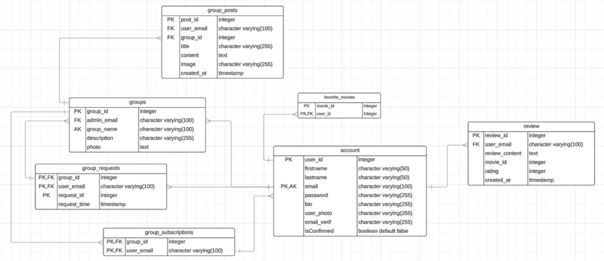

# Movie Zone Web Application


## Project Overview
This project is a user-friendly web application designed for movie enthusiasts, enabling users to explore movies, view showtimes, create groups, and engage with other users. It integrates the Movie Database (TMDB) for movie information and Finnkino for showtime details. Users have the ability to register, manage their lists of favorite movies, compose reviews, and share profiles. The platform provides a dynamic and interactive experience tailored for individuals passionate about movies.

## Features
1. **Responsive Design**: Scales across different screen sizes.
2. **User Authentication**: Secure sign-up, login, and logout. Passwords must include a capital letter and a number.
3. **Account Management**: Users can edit, manage, and delete their accounts, including all related data.
4. **Movie Search**: Search and filter movies by genre, rating, and release date.
5. **Showtimes**: Browse Finnkino showtimes in various cinemas.
6. **Groups**: Signed users can create, join, and manage groups.
7. **Membership Management**: Group admins can approve or decline users’ requests to join the group and also remove already subscribed ones.
8. **Movie Reviews**: Add reviews with descriptions, ratings, and timestamps.
9. **Favorites**: Create, add, and share favorite lists of movies.
10. **Optional Features**: Email confirmation, management of user personal page, group admin dashboard.

## Technologies and Tools

### Frontend:
- **React**: For building a dynamic and interactive user interface.
- **Bootstrap**: To make a responsive and visually appealing design.
- **Axios**: For making seamless API calls to fetch data from external sources.

### Backend:
- **Node.js**: To handle server-side logic and processing.
- **Express**: To simplify frontend interaction with APIs.
- **PostgreSQL**: To store and manage the app’s data.

### APIs:
- **TMDB**: To fetch detailed movie information like titles, posters, and ratings.
- **Finnkino**: To provide up-to-date movie showtimes and schedules.
- **ImgBB**: To store uploaded user photos.
- **EmailJS**: To send confirmation emails to verify users' email addresses.

### Development Tools:
- **Vite**: Used as a build tool for efficient development.
- **Bcrypt**: For hashing passwords to ensure secure user authentication.
- **Dotenv**: For storing API keys and sensitive data.
- **JWT (JSON Web Tokens)**: For implementing secure authentication mechanisms.
- **Multer**: To handle user file uploads such as profile pictures.
- **Nodemon**: To streamline development by automatically restarting the server when code changes.
- **Mocha & Chai**: For writing and executing unit tests to ensure code reliability.
- **Sharp**: Used for image processing such as resizing movie posters and user-uploaded files.

## Team Contributions
| Name               | Contribution                                                   |
|--------------------|-----------------------------------------------------------------|
| Maksim Kalashnikov | Wireframes, database structure, frontend and backend features, deployment, testing |
| Duy Nguyen         | Wireframes, frontend and backend features, deployment, managing backlog |
| Cuong Tran         | Wireframes, frontend and backend features, deployment, UI responsiveness |
| Nishan Thapa       | Wireframes, frontend and backend features, managing backlog    |
| Archana Ojha       | Wireframes, frontend and backend features, deployment, documenting REST API |
| Shyama Wijayarathna | Wireframes, frontend and backend features, deployment, UI responsiveness |

## Architecture Layers of MovieZone

### Database Structure
Our relational database was implemented in PostgreSQL in Azure. Below is the Entity-Relationship Diagram:



#### Tables Overview:
- **Account**: Stores user data (names, contact, bio, photo, credentials).
- **Review**: Contains user reviews, ratings, likes/dislikes, and timestamps.
- **Groups**: Holds group info (admin, description, photo).
- **Group Subscriptions**: Links users to groups (many-to-many).
- **Group Posts**: Stores posts in groups with content, images, and timestamps.
- **Favorite Movies**: Tracks users' favorite movies (many-to-many).
- **Group Requests**: Manages user requests to join groups with timestamps.

Foreign keys are used to maintain data integrity between related tables, ensuring that relationships are consistent. Cascading deletion is implemented to automatically remove dependent data when a related record is deleted, keeping the database clean and organized.

### Frontend (React):
The frontend is designed to provide a user-friendly interface, built with reusable components to enhance maintainability, implementing Single-Page Application architecture. It communicates with the backend through REST API calls, utilizing tools like Axios for data exchange. State management is handled efficiently using the Context API to ensure a seamless user experience.

### Backend (Node.js):
The backend follows the MVC (Model-View-Controller) architecture to ensure a structured and organized codebase. It manages the business logic and handles API endpoints through controllers, processes data using models, and defines how the data is presented. It also authenticates users, manages sessions securely, and interacts with the PostgreSQL database to store, retrieve, and update data efficiently.

## Deployment
Frontend and Backend: Deployed on a VPS hosted by DigitalOcean.

## Installation and Usage

### Prerequisites:
- Node.js and npm installed.
- PostgreSQL database set up.

### Installation Steps:
1. **Clone the repository**:
   ```bash
   git clone https://github.com/Movie-App-Project-OAMK-G15/movie_app.git
2. **Navigate to the directory**:
   ```bash
   cd movie_app
  3. **Install dependencies for the front and backends**:
   
      ```bash
     npm install

4. **Set up the PostgreSQL database and configure two environment variable files (.env files) for database connection and API keys.**:
   #### Server `.env` File:
    ```plaintext
    PORT=10000
    DB_PORT=YOURDATABASE
    DB_USER=DATABASEUSERNAME
    DB_HOST=DATABASEHOSTNAME
    TEST_DB_NAME=TESTDATABASENAME
    DB_NAME=MAINDATABASENAME
    DB_PASSWORD=DATABASEPASSWORD!
    SSL=true
    JWT_SECRET_KEY='YOURJWTKEY'
    IMGBB_API_KEY=IMGBBAPIKEY

  ####  `.env` file for App:
      ```plaintext
      VITE_TMDB_API_KEY=TMDBAPIKEY
      VITE_API_URL=http://localhost:3001
      VITE_EMAILJS_KEY=EMAILJSAPIKEY

## Start the Applications

### Start the frontend React application and the backend server with the following command:
    ```bash
    npm run dev
    
    

### Access the Application

- **Access the Application at**: [http://localhost:5173](http://localhost:5173)
- **Live Version**: [http://167.71.38.0:43937](http://167.71.38.0:43937)
- **GitHub Repository**: [MovieZone GitHub Repository](https://github.com/Movie-App-Project-OAMK-G15/movie_app.git)
- **Figma Link**: [MovieZone UI wireframes](https://www.figma.com/design/kQ5mvX6iqV27uTgY2RN8Mu/Movie-app-wireframes?node-id=0-1)
- **Database Diagram**: [MovieZone Database Diagram](https://lucid.app/lucidchart/e2b72376-f028-42f3-a019-0d7ed4db38ee/edit?invitationId=inv_d0e75d2c-6003-4af3-bf5d-3cf0f76de553&page=0_0#)